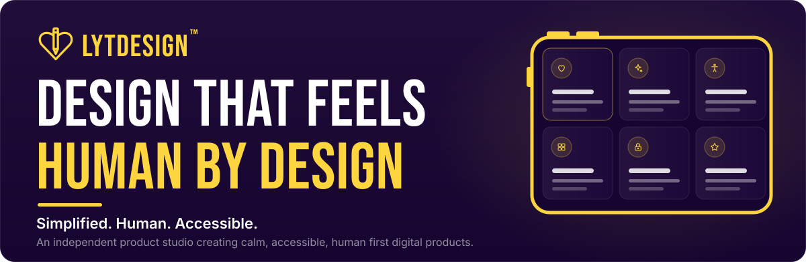
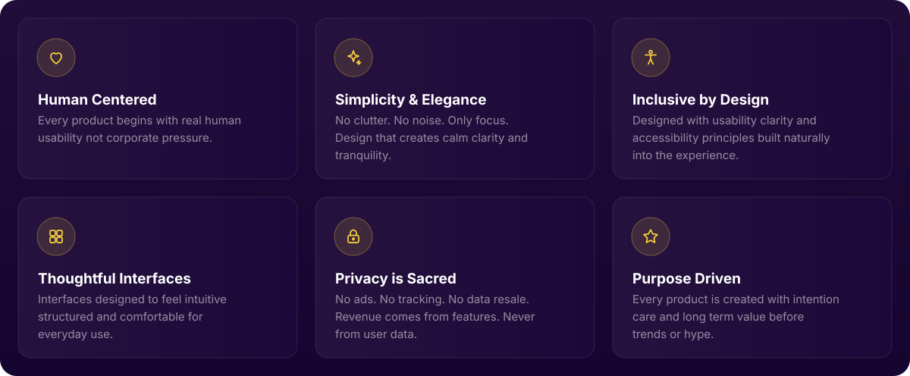
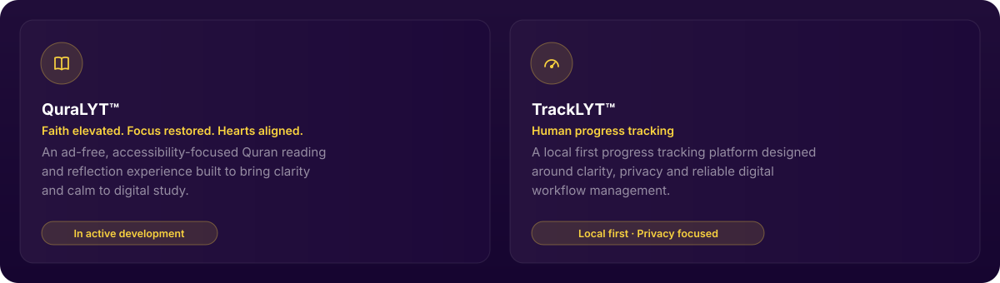

 

[**About**](#about) &nbsp;·&nbsp; [**Foundation**](#foundation) &nbsp;·&nbsp; [**LYTGrid**](#lytgrid) &nbsp;·&nbsp; [**Products**](#products) &nbsp;·&nbsp; [**Contact**](#contact)

 

> **"The world doesn't need more software.**
> **It needs *softer software.*"**
> &nbsp;&nbsp;&nbsp;&nbsp;*Built with heart. Not hype.*

 

## About

I created LYTDesign from the belief that modern software has become increasingly complex, distracting, and data driven. Rather than building more technology for its own sake, I want to explore a calmer approach, one where thoughtful design, privacy, and simplicity help people accomplish more with less friction.

<table>
<tr>
<td width="33%" valign="top">

### Simplified

Most software adds. I try to remove. Every additional menu, every additional setting, every additional notification is a small tax on someone's attention. I start from the question of what can be taken away, not what can be added.

</td>
<td width="33%" valign="top">

### Human

Technology is often built around engagement metrics, retention curves, and growth targets, treating the person using it as a source of data rather than someone to actually serve. I start from the opposite direction: what does a real person, in a real moment, actually need from this screen right now.

</td>
<td width="33%" valign="top">

### Accessible

Accessibility is frequently treated as a compliance checklist, addressed near the end of a project once the "real" design is already finished. I treat it as a starting constraint, not a final pass, because software that only works well for some people is not actually simple, and it is not actually human centred either.

</td>
</tr>
</table>

<b>Why calm software, privacy, and thoughtful interfaces matter</b>

 

**Calm software.** Constant notifications, infinite feeds, and attention driven design have made much of modern software exhausting to use, even when it works exactly as intended. Calm software is a deliberate rejection of that model: interfaces that inform without demanding, and that let a person finish what they came to do and then leave, rather than staying by design.

**Privacy is foundational, not a feature.** Once a product's business model depends on collecting and monetizing user data, every future design decision quietly bends toward extracting more of it. I avoid that dependency entirely, because privacy that can be turned off, sold, or renegotiated later was never really privacy to begin with.

**Thoughtful interfaces.** An interface is not just a visual layer. It is the entire relationship between a person and a piece of software. I treat every interaction, not just the visual design, as something worth deliberately shaping.

 

## Foundation

This is not a feature list. It is closer to a set of commitments every LYTDesign product is expected to hold to.

 

## LYTGrid

**LYTGrid™** is my design system, and the shared language behind every product I create. It is best understood as four related things at once:

| | |
| :--- | :--- |
| **A design philosophy** Clarity should never be sacrificed for density, and a person should never need to search for something that should simply be visible. | **A layout philosophy** Every feature receives its own dedicated, visible space, structured as a grid of purposeful boxes rather than menus, tabs, or deeply nested navigation. |
| **A cognitive UI system** The structure is designed around how much a person can reasonably hold in mind while using software, not around how many features can be crammed onto a single screen. | **A shared language across products** LYTGrid is not tied to a single app. It is the interface language every current and future LYTDesign product is expected to build on. |

Nothing is hidden, nothing is nested more than one layer deep, and important actions remain visible rather than buried in deep navigation. Learning the interaction pattern once means understanding it everywhere across LYTDesign's products.

LYTGrid's most developed implementation today lives inside QuraLYT, refined through real, day to day use.

 

## Products

Rather than building isolated applications, I am building a connected ecosystem of products that share one design language, one philosophy, and one commitment to thoughtful software.

[**QuraLYT documentation →**](https://github.com/lytdesign/Quralyt) &nbsp;·&nbsp; [**Explore the ecosystem →**](https://www.lytdesign.com/ecosystems.html)

Future products will be added here as they reach a stage worth sharing publicly, each built on the same foundation and the same design system.

 

## A Personal Note

> LYTDesign is an independent product studio, founded in 2025, built by one person rather than a company or a team. I didn't start LYTDesign to build QuraLYT, or TrackLYT, or any single product. I started it because I kept encountering software that felt like it was working against the people using it, and I wanted to find out what it would look like to build the opposite.
>
> I am not asking the world to download what I build. I am asking people to build with me, because the world does not need more software. It needs softer software.
>
> **S.M.** · Founder, LYTDesign™

 

## Contact

I build LYTDesign step by step, and I welcome designers, developers, and thoughtful feedback that share these values.

| | |
| :--- | :--- |
| **Designers and developers** | People who care about thoughtful, inclusive technology |
| **Creative collaborators** | Organizations interested in accessible technology and public impact |
| **Supporters and believers** | Encouragement and ideas that help this vision move forward |

[**www.lytdesign.com**](https://www.lytdesign.com) &nbsp;·&nbsp; [**info@lytdesign.com**](mailto:info@lytdesign.com)

 

## License

Licensing information will be published individually for each project as it reaches public release.

 

Independent product studio · Founded 2025 · Norway

